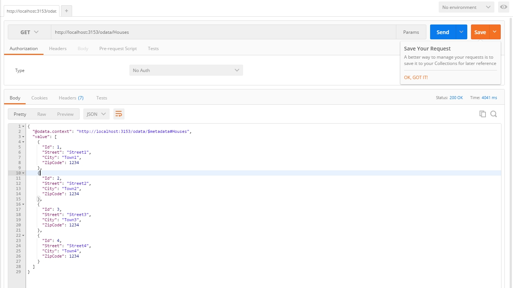
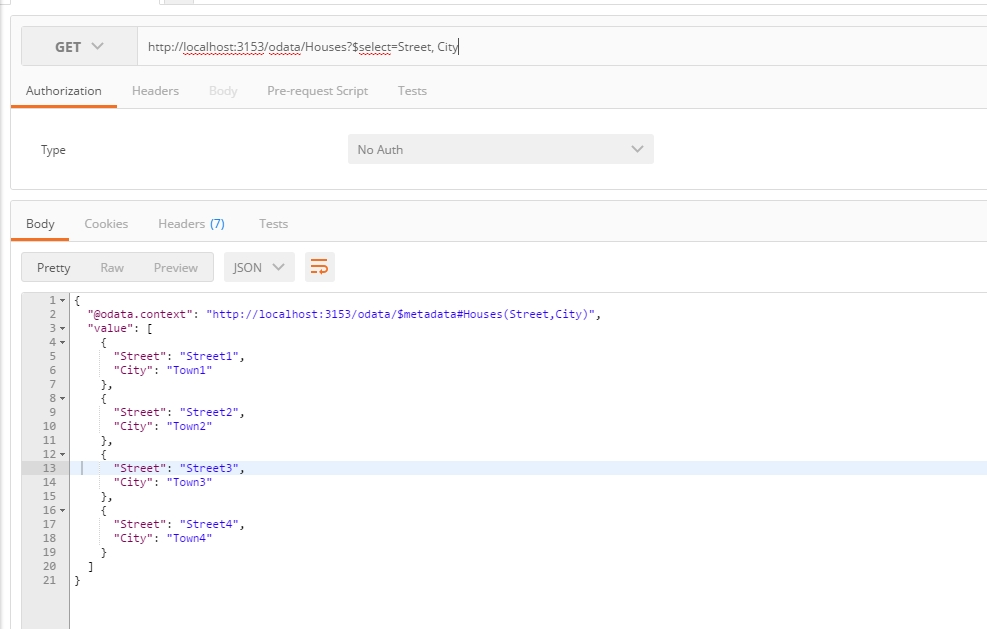
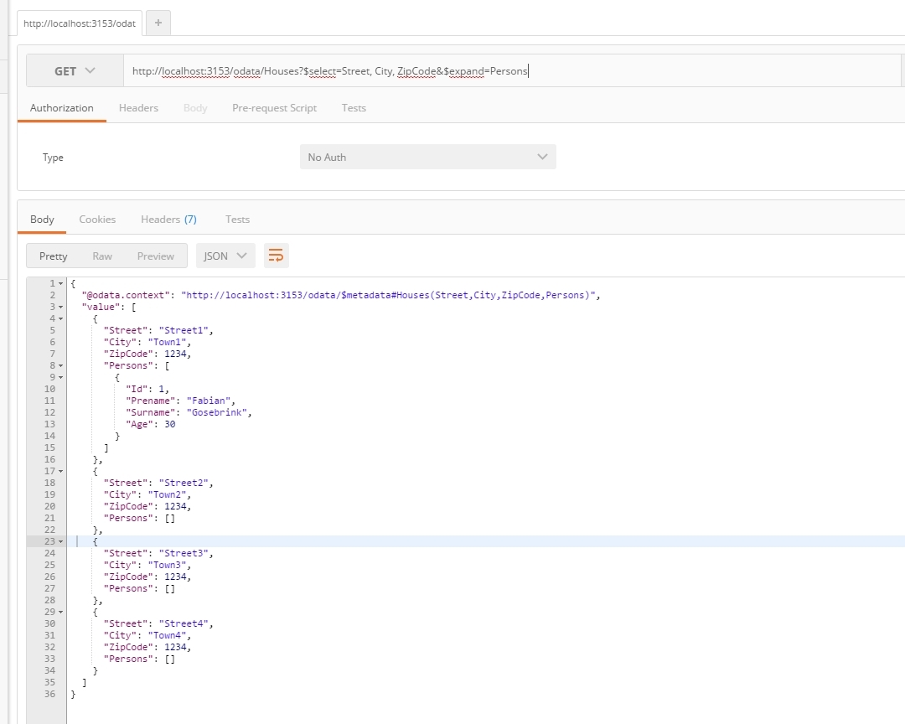

# ASP.NET - WebAPI - OData - Entity Framework

### In this repository I want to show you an Odata sample of an ASP.NET WebAPI.

Before you run this sample make sure you install all nuget packages. The repo is using [Ninject](http://www.ninject.org/) as dependency injection resolver.

After starting this repo with Visual Studio you can use [Postman](https://chrome.google.com/webstore/detail/postman/fhbjgbiflinjbdggehcddcbncdddomop) to fire queries against the database.

The endpoint is available through `[yourHost]/odata/`

### Querying normal data 

`http://localhost:3153/odata/Houses`

### Querying data with select (datashaping)

`http://localhost:3153/odata/Houses?$select=Street, City`

### Querying data with select (datashaping) and child properties with $expand

`http://localhost:3153/odata/Houses?$select=Street, City, ZipCode&$expand=Persons`

